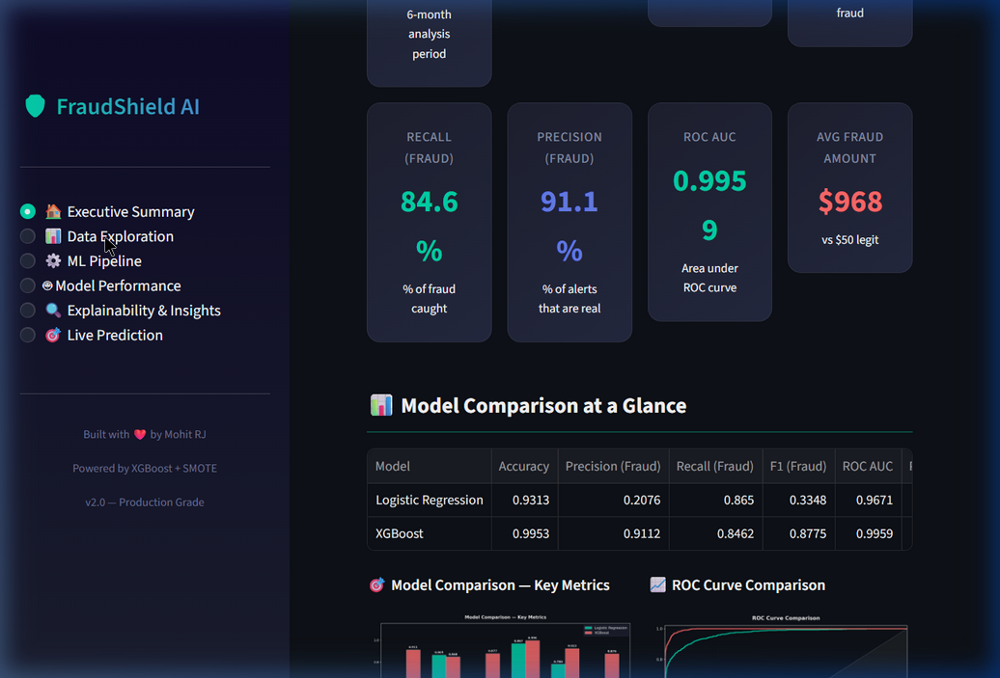
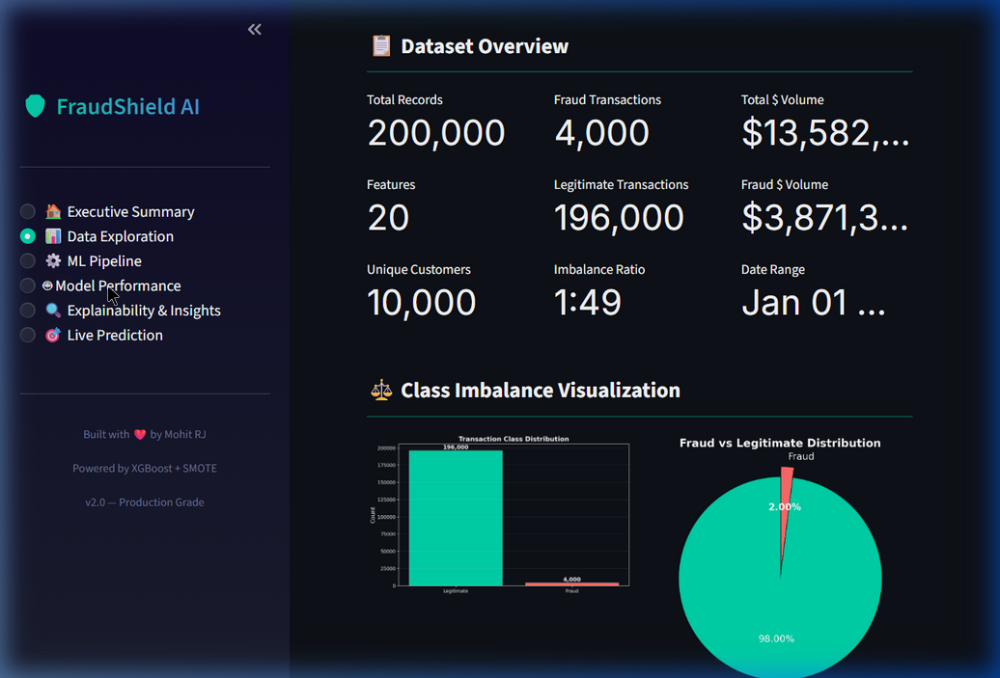
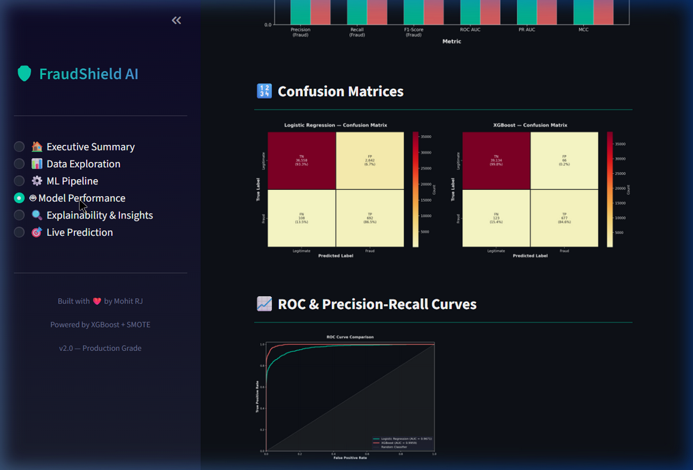
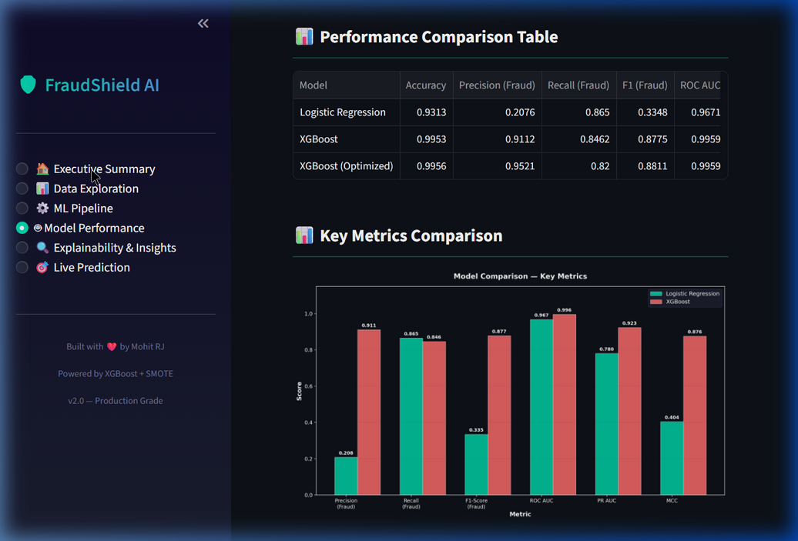
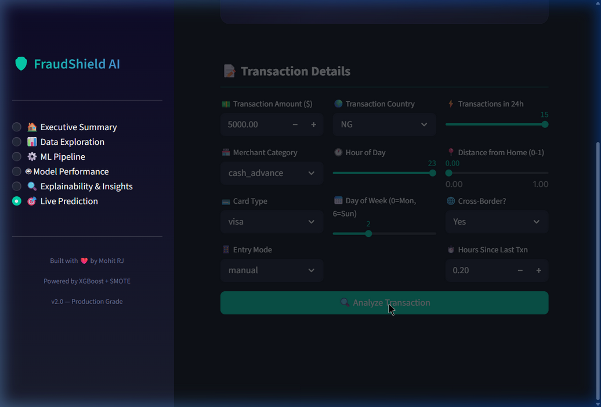

🛡️ [FraudShield AI →](https://fraud-detection-ml-pipeline-y3htsbzzxgdwue2ar2fx6h.streamlit.app/) AI-Powered Financial Fraud Detection System
 
    An end-to-end machine learning pipeline for detecting fraudulent financial transactions using advanced imbalanced data handling techniques.
<p align="center">
    
    
    
    
    
    
</p>

---

## 🎯 Problem Statement

Financial fraud is a **$32 billion global problem** that affects banks, merchants, and consumers. Traditional rule-based fraud detection systems fail to catch sophisticated fraud patterns, leading to significant financial losses.

**The challenge:** Real-world fraud data is **extremely imbalanced** — typically only **1-2% of transactions** are fraudulent. Most ML models trained on such data will simply predict "not fraud" for everything and achieve 98%+ accuracy while catching **zero** actual fraud.

This project addresses this challenge with:
- **SMOTE-based resampling** to handle class imbalance
- **XGBoost** optimized for precision-recall on minority class
- **Threshold optimization** for business-specific cost trade-offs
- **Production-grade Streamlit dashboard** for real-time fraud detection

---

## 📊 Results

| Metric | Logistic Regression | XGBoost | XGBoost (Optimized) |
|--------|:-------------------:|:-------:|:-------------------:|
| **Accuracy** | 0.9313 | 0.9953 | 0.9956 |
| **Precision (Fraud)** | 0.2076 | 0.9112 | 0.9521 |
| **Recall (Fraud)** | 0.8650 | 0.8462 | 0.8200 |
| **F1-Score (Fraud)** | 0.3348 | **0.8775** | **0.8811** |
| **ROC AUC** | 0.9671 | **0.9959** | 0.9959 |
| **PR AUC** | 0.7804 | **0.9232** | 0.9232 |
| **MCC** | 0.4040 | **0.8757** | 0.8757 |
| **Potential Savings** | $3.46M | **$3.39M** | $3.39M |

> **Key Insight:** XGBoost achieves a **91.1% precision** and **84.6% recall** on fraud detection — meaning 91% of flagged transactions are actual fraud, and the model catches 85% of all fraudulent activity. The optimized threshold further pushes precision to **95.2%**.

---

## 🖥️ Dashboard Screenshots

### Executive Summary
<p align="center">
  
</p>

### Data Exploration & Class Imbalance
<p align="center">
  
</p>

### Model Performance — Confusion Matrices & ROC Curves
<p align="center">
  
</p>

### Model Comparison — Key Metrics
<p align="center">
  
</p>

### Live Fraud Prediction Engine
<p align="center">
  
</p>

---

## 🏗️ Architecture

```
┌─────────────────────────────────────────────────────────────┐
│                    FraudShield AI Pipeline                   │
├─────────────────────────────────────────────────────────────┤
│                                                             │
│   ┌──────────┐   ┌──────────────┐   ┌────────────────┐     │
│   │  DATA     │──▶│ PREPROCESSING│──▶│  MODEL TRAINING│     │
│   │ GENERATOR │   │              │   │                │     │
│   │           │   │ • Feature    │   │ • Logistic Reg │     │
│   │ 200K txns │   │   Engineering│   │ • XGBoost      │     │
│   │ 2% fraud  │   │ • Encoding   │   │ • Threshold    │     │
│   │ 21 feats  │   │ • Scaling    │   │   Optimization │     │
│   └──────────┘   │ • SMOTE      │   └───────┬────────┘     │
│                   └──────────────┘           │              │
│                                              ▼              │
│   ┌──────────────┐   ┌──────────────┐   ┌────────────┐     │
│   │ EXPLAINABILITY│◀──│  EVALUATION  │◀──│  PREDICTION│     │
│   │              │   │              │   │            │     │
│   │ • Feature    │   │ • Precision  │   │ • Live     │     │
│   │   Importance │   │ • Recall     │   │   Scoring  │     │
│   │ • Permutation│   │ • F1 / MCC   │   │ • Risk     │     │
│   │ • Business   │   │ • ROC / PR   │   │   Analysis │     │
│   │   Insights   │   │ • Cost-Benefit│  │            │     │
│   └──────────────┘   └──────────────┘   └────────────┘     │
│                                                             │
│   ┌─────────────────────────────────────────────────────┐   │
│   │              STREAMLIT DASHBOARD (6 PAGES)          │   │
│   │  Executive Summary │ Data Explorer │ ML Pipeline    │   │
│   │  Model Performance │ Explainability│ Live Prediction│   │
│   └─────────────────────────────────────────────────────┘   │
└─────────────────────────────────────────────────────────────┘
```

---

## 📁 Project Structure

```
fraud-detection-ml-pipeline/
├── app.py                          # Streamlit dashboard (main entry)
├── run_pipeline.py                 # Standalone pipeline runner
├── requirements.txt                # Dependencies
├── .streamlit/
│   └── config.toml                 # Dark theme configuration
├── src/
│   ├── __init__.py
│   ├── data_generator.py           # Synthetic fraud dataset (200K records)
│   ├── preprocessing.py            # Feature engineering + SMOTE pipeline
│   ├── model.py                    # LR + XGBoost training & saving
│   ├── evaluation.py               # Metrics, charts, cost analysis
│   └── explainability.py           # Feature importance & business insights
├── data/
│   └── transactions.csv            # Generated dataset
├── models/
│   ├── logistic_regression.pkl     # Trained LR model
│   ├── xgboost_model.pkl           # Trained XGBoost model
│   ├── scaler.pkl                  # Fitted RobustScaler
│   ├── encoders.pkl                # Fitted label encoders
│   ├── feature_names.pkl           # Feature column names
│   └── metadata.pkl                # Model metadata
├── assets/
│   └── screenshots/                # Dashboard screenshots
├── .gitignore
├── LICENSE
└── README.md
```

---

## 📊 Dataset

| Property | Value |
|----------|-------|
| **Total Transactions** | 200,000 |
| **Fraud Rate** | 2.0% (4,000 fraud / 196,000 legit) |
| **Imbalance Ratio** | 1:49 |
| **Time Period** | Jan 2024 – Jun 2024 |
| **Unique Customers** | ~10,000 |
| **Total $ Volume** | ~$13.5M |
| **Features** | 21 raw + 4 engineered = 25 total |

### Feature Categories

| Category | Features |
|----------|----------|
| **Transaction** | `amount`, `merchant_category`, `card_type`, `entry_mode` |
| **Geographic** | `country`, `city`, `is_cross_border`, `distance_from_home` |
| **Temporal** | `hour_of_day`, `day_of_week`, `is_weekend`, `is_night` |
| **Behavioral** | `customer_txn_count`, `rolling_avg_amount`, `amount_deviation`, `time_since_last_txn`, `velocity_24h` |
| **Engineered** | `amount_x_distance`, `amount_x_night`, `velocity_x_deviation`, `cross_border_x_night`, `log_amount`, `amount_bucket`, `hour_bucket`, `is_high_value`, `is_rapid_succession` |

### Fraud Patterns Built Into Dataset
- 🔴 **High-amount anomalies** — Transactions significantly above customer's average
- 🔴 **Midnight activity** — Disproportionate fraud during 10 PM – 5 AM
- 🔴 **Cross-border risk** — International transactions with higher fraud propensity
- 🔴 **Rapid succession** — Multiple transactions in short time windows
- 🔴 **Risky merchants** — Cash advance, money transfer, gambling, jewelry
- 🔴 **Manual entry** — Card-not-present and manual key transactions

---

## 🔬 Approach

### 1. Imbalanced Data Strategy (Critical)

```
Original Data: ~2% Fraud, ~98% Legitimate
          ↓
   Stratified Split (80/20)
          ↓
   Training Set              Test Set (UNTOUCHED)
          ↓                        ↓
   Apply SMOTE               Original distribution
   (oversample minority)     (real-world evaluation)
          ↓
   Balanced Training Set
   (~67% Legit, ~33% Fraud)
          ↓
   Train Models
          ↓
   Evaluate on Original Test Set
```

> ⚠️ **Critical:** SMOTE is applied **only to the training set**. The test set is never touched — it reflects real-world distribution. This prevents data leakage and ensures honest evaluation metrics.

### 2. Feature Engineering
- **Interaction features**: `amount × distance`, `amount × night`, `velocity × deviation`
- **Log transform**: Reduces right-skew in transaction amounts
- **Temporal buckets**: Business hours vs late night vs early morning
- **Binary flags**: `is_high_value`, `is_rapid_succession`

### 3. Model Training
| Aspect | Logistic Regression | XGBoost |
|--------|:-------------------:|:-------:|
| **Role** | Baseline | Primary |
| **Imbalance** | `class_weight='balanced'` | `scale_pos_weight` |
| **Tuning** | C=0.1, L-BFGS solver | 500 trees, depth=6, lr=0.05 |
| **Evaluation** | 5-fold CV (F1) | 5-fold CV (F1) + early stopping |

### 4. Evaluation Philosophy
- **Accuracy is NOT enough** — A dummy classifier achieves 98% accuracy on 2% fraud data
- **Primary metrics**: Precision, Recall, F1-Score on the fraud (minority) class
- **PR AUC > ROC AUC** — PR curve is more informative for imbalanced datasets
- **Cost-benefit analysis**: False negative = $5,000 loss vs False positive = $50 cost
- **Threshold optimization**: Find the threshold that maximizes F1-score

---

## 💡 Key Business Insights

| Insight | Finding |
|---------|---------|
| **🎯 Top Predictor** | Transaction amount is the #1 fraud signal |
| **💰 Amount Red Flag** | Fraud transactions average **~$968** vs **$50** for legitimate |
| **🌙 Time Pattern** | ~40%+ of fraud occurs during nighttime (10 PM – 5 AM) |
| **🌍 Cross-Border Risk** | Cross-border transactions are 3-5x more likely to be fraudulent |
| **⌨️ Manual Entry** | Manual card entry has the highest fraud rate among all entry modes |
| **🏪 Risky Categories** | Cash advance, money transfer, and gambling are highest-risk merchants |
| **📈 Financial Impact** | The model generates **$3.4M+ in potential savings** from caught fraud |

---

## 🚀 Quick Start

### Cloud
The app is live at: **[FraudShield AI →](https://fraud-detection-ml-pipeline-y3htsbzzxgdwue2ar2fx6h.streamlit.app/)**

### Prerequisites
- Python 3.10+
- pip

### Installation

```bash
# Clone the repository
git clone https://github.com/mohitrj18greybeard/fraud-detection-ml-pipeline.git
cd fraud-detection-ml-pipeline

# Install dependencies
pip install -r requirements.txt
```

### Run the Pipeline (Generate Data + Train Models)

```bash
python run_pipeline.py
```

### Launch the Dashboard

```bash
streamlit run app.py
```

Then open **http://localhost:8501** in your browser.

---
```


## 🛠️ Tech Stack

| Component | Technology |
|-----------|-----------|
| **Language** | Python 3.10+ |
| **ML Framework** | Scikit-learn, XGBoost |
| **Imbalanced Data** | imbalanced-learn (SMOTE) |
| **Data Processing** | Pandas, NumPy |
| **Visualization** | Matplotlib, Seaborn |
| **Explainability** | SHAP, Permutation Importance |
| **Dashboard** | Streamlit |
| **Serialization** | Joblib |

---

## 🔮 Future Improvements

- [ ] Deep learning model (LSTM for sequential transaction patterns)
- [ ] Real-time streaming with Apache Kafka
- [ ] PostgreSQL integration for transaction storage
- [ ] Docker containerization
- [ ] A/B testing framework for model versions
- [ ] API endpoint with FastAPI for production serving
- [ ] Graph neural network for customer network fraud detection

---

## 📜 License

This project is licensed under the MIT License — see the [LICENSE](LICENSE) file for details.

---

## 👤 Author

**Mohit** — [GitHub](https://github.com/mohitrj18greybeard)

---

<p align="center">
  <sub>Built with ❤️ as a production-grade ML portfolio project</sub>
</p>
